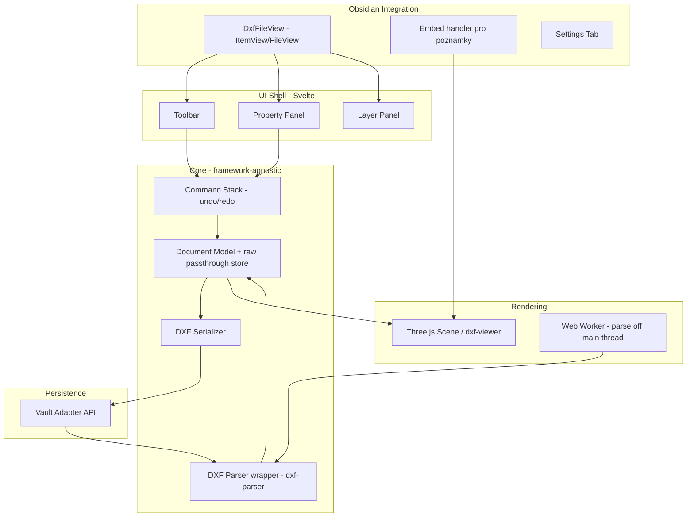

# Design doc: Obsidian DXF Viewer & Editor Plugin

Status: draft v1 — vstupní kontext pro implementaci (Claude Code)
Rozsah v1: **pouze DXF**. DWG je vědomě odloženo na roadmapu, viz sekci 2.

---

## 1. Cíl

Obsidian plugin, který:
- zobrazí `.dxf` soubory ve vaultu jako plnohodnotný file view (klik v exploreru → tab, obdoba PDF viewer),
- umožní ten samý výkres **embedovat do poznámky** přes `![[vykres.dxf]]`,
- podporuje **omezenou editaci** (viz sekce 8) s uložením zpět do `.dxf`,
- běží **na desktopu i mobilu od první verze**.

Necílíme na to nahradit CAD software. Cílíme na "rychlý pohled a drobnou úpravu bez opouštění Obsidianu".

## 2. Explicitní non-goals (v1)

- **DWG** — žádná podpora ani čtení. Jediná reálná cesta (LibreDWG/WASM) je GPL a nezralá (viz research níže), přidáváme až jako samostatnou fázi, izolovaně, ne jako závislost architektury od začátku.
- Kompletní pokrytí DXF specifikace. Nepodporované entity se **zobrazí jako "unsupported" placeholder** a při uložení se **zachovají beze změny** (viz sekce 8.3) — nikdy se tiše nezahodí.
- Žádný cloud/network parsing. Vše lokálně, offline, v souladu s Obsidian Developer Policy (žádné odesílání souborů uživatele mimo vault bez explicitního opt-in a README disclosure).
- Real-time collaborative editing.

## 3. Proč Svelte + vanilla TS/three.js (ne React, ne čistě vanilla)

Rozhodnutí, ne otevřená otázka:

- **UI shell (toolbar, property panel, layer list, settings tab)** → Svelte. Kompiluje se na vanilla JS bez runtime, žádný virtual DOM overhead. Toto je i oficiální doporučení v Obsidian Developer Docs pro pluginy, kde záleží na velikosti/výkonu.
- **Rendering engine (canvas/WebGL)** → vanilla TS + three.js, obalené vlastní tenkou vrstvou (ne cizí `cad-simple-viewer` — viz předchozí diskuze, důvod: menší závislost, žádné GPL zapletení, žádná vazba na nezralý balíček jednoho maintainera). Renderer je frameworku lhostejný — three.js scéna se stejně řídí imperativně přes `requestAnimationFrame`, bez ohledu na to, jestli chrome kolem je Svelte nebo React.
- **Proč ne React**: `obsidian-excalidraw-plugin` (nejbližší reálná analogie — canvas nástroj, file view + embed + mobil) je na Reactu a museli ho loni rozdělit na dva pluginy („Excalidraw“ + „Excalidraw Extras“), explicitně kvůli velikosti bundlu, startup výkonu a mobilní synchronizaci (cíl: dostat core pod 5 MB). To je přesně riziko, kterému chceme předejít architekturou od začátku, ne řešit dodatečně split-em.
- **Riziko volby Svelte**: menší ekosystém/méně kontributorů obeznámených se Svelte než s Reactem. Pro sólo/malý tým projekt akceptovatelné.

**Explicitní pravidlo pro Claude Code**: rendering vrstva (three.js scéna, batching, parsing) nesmí nikdy záviset na Svelte komponentách a naopak. Hranice mezi nimi je čistý JS/TS modul s event emitterem, ne Svelte stores přímo v rendereru — udržuje to renderer testovatelný a znovupoužitelný i mimo Obsidian (užitečné pro budoucí headless testy).

## 4. Architektura — vysoká úroveň

## 5. Integrace s Obsidian API

- `this.registerExtensions(["dxf"], VIEW_TYPE_DXF)` + `this.registerView(VIEW_TYPE_DXF, ...)` pro otevírání `.dxf` jako file view.
- **Embed (`![[soubor.dxf]]`) — ověřit, ne předpokládat.** Moje znalost mechanismu embedování pro custom extension views není jistá na 100 % (Obsidian API se v této oblasti mění). Claude Code by měl na začátku implementace udělat krátký spike: zaregistrovat extension view podle vzoru PDF/image pluginů a ověřit proti aktuálnímu `obsidian.d.ts`, jestli embed funguje automaticky, nebo je potřeba vlastní `MarkdownPostProcessor`/`registerMarkdownCodeBlockProcessor`. Nezakládat na tom časový odhad bez ověření.
- Souborové I/O výhradně přes **Vault adapter** (`app.vault.readBinary`, `app.vault.modifyBinary`, `app.vault.createBinary`) — **ne** Node `fs`. Nutné kvůli mobilu (Node/Electron API tam nejsou dostupné). `isDesktopOnly` v manifestu musí zůstat `false`/nepřítomné.
- Nastavení přes `Setting` API (ne HTML heading tagy) — konzistence s Obsidian UI guidelines.
- `this.app`, nikdy globální `app`/`window.app`.
- Žádné `innerHTML`/`outerHTML` s obsahem odvozeným ze souboru — **DXF TEXT/MTEXT entity obsahují libovolný string ze souboru uživatele/třetí strany a musí se traktovat jako nedůvěryhodný vstup.** Stavět přes `createEl`/`createSpan`/DOM API, ne stringovou interpolaci do HTML.

## 6. Web Worker + WASM úvahy (i bez DWG relevantní kvůli výkonu)

- Parsing většího DXF (tisíce entit) patří do Web Workeru, ne na hlavní vlákno — jinak zamrzne UI Obsidianu při otevření většího souboru.
- Bundling workeru přes esbuild vyžaduje vlastní konfiguraci (worker jako samostatný build output, ne inline) — ověřit proti aktuálnímu `esbuild.config.mjs` ze sample-plugin šablony, tam to není z krabice.
- Na mobilu (Capacitor WebView) chování Workerů může být jinačí než na desktopu — **otestovat brzy na reálném mobilním zařízení**, ne až na konci. Tohle je jeden z bodů, kde bych čekal největší množství "funguje na desktopu, nefunguje na mobilu" překvapení.

## 7. Datový model

- Vlastní `DxfDocument` model nad výstupem `dxf-parser`, ne cizí "document database" (`cad-simple-viewer` apod.) — důvod viz sekce 3 a předchozí diskuze o závislostech.
- **Raw passthrough store**: pro každou sekci/entitu, které model nerozumí, se uchová surová DXF reprezentace 1:1. Při serializaci se nepoznané části vypíšou beze změny, upravují se jen entity, které uživatel skutečně editoval přes UI. Toto je jediná rozumná obrana proti tichému poškození souborů, které vznikly v jiném CAD software (viz sekce 8.3).
- Command stack pro undo/redo — implementovat jako sekvenci reverzibilních příkazů (např. `MoveEntityCommand`, `DeleteEntityCommand`), ne diff celého dokumentu. Otevřená otázka: jak se toto chová vůči Obsidianímu vlastnímu undo v editoru poznámky, pokud je view otevřený jako embed uvnitř editovatelné poznámky — potřeba prozkoumat, možná vlastní undo scope izolovaný na file view.

## 8. Rozsah editace (v1 MVP)

### 8.1 Podporované entity pro zobrazení
LINE, CIRCLE, ARC, LWPOLYLINE, POLYLINE, TEXT, basic MTEXT, INSERT (bloky — minimálně flattened render), layers, barvy.

### 8.2 Podporované entity pro editaci
LINE, CIRCLE, ARC, LWPOLYLINE, TEXT — pouze: výběr, posun, smazání, změna vrstvy/barvy. Žádné rotate/scale/copy ve v1 — přidat až po ověření, že základ (select → move → save → soubor se otevře v AutoCADu/jiném CAD bez poškození) skutečně funguje spolehlivě.

### 8.3 Round-trip bezpečnostní síť
Před releasem musí existovat automatizovaný test: načíst reálný (ne uměle vytvořený) DXF soubor → neprovést žádnou editaci → uložit → binárně/strukturálně porovnat s originálem mimo entit, kde se očekává formátovací normalizace. Pokud tohle nefunguje spolehlivě na sadě různě starých DXF verzí, nejde do releasu editace, jen zobrazení.

## 9. Fázový plán

| Fáze | Obsah | Poznámka |
|---|---|---|
| M0 | Skeleton plugin, DXF file view, jen zobrazení, jen desktop | Ověřit `dxf-parser` + `dxf-viewer` integraci |
| M1 | Mobilní kompatibilita zobrazení | Real device test, ne jen simulátor |
| M2 | Embed do poznámek | Spike z sekce 5 musí proběhnout tady |
| M3 | Selekce entit + property panel (read-only) | |
| M4 | Editace v paměti (bez uložení) | Move/delete na whitelisted entitách |
| M5 | Serializace + uložení s round-trip testem | Nejrizikovější fáze, nejvíc času na testování |
| M6 | Polish, nastavení, příprava na submission | Viz sekce 10 |

## 10. Platformní pravidla (shrnutí pro review-proof kód)

- `manifest.json`: `id` nesmí obsahovat "obsidian", `version` v semver, `minAppVersion` nastavené na reálně otestovanou verzi, `isDesktopOnly: false`.
- Žádný obfuskovaný kód, žádná dynamická aktualizace mimo Obsidian update mechanismus, žádná telemetrie bez explicitního opt-in a disclosure v README.
- Pokud plugin bude mít network use v budoucnu (např. stažení fontů) — musí být jasně popsané v README, jinak porušuje Developer Policy.
- ESLint s Obsidian-specific pravidly (ze `obsidian-sample-plugin` template) — spustit jako součást CI od prvního commitu, ne dodatečně.
- iOS regex lookbehind (`(?<=`, `(?<!`) nejsou podporované před iOS 16.4 — zkontrolovat, jestli `dxf-parser`/`dxf-viewer` nebo jejich závislosti něco takového používají (audit dependencies).

## 11. Otevřené otázky pro Claude Code k prověření na začátku (ne k domýšlení)

1. Přesný mechanismus embedování custom file extension view v aktuální verzi `obsidian.d.ts`.
2. Chování Web Workerů v Obsidian mobile WebView — funguje bez úprav, nebo je potřeba polyfill/fallback?
3. Kolize undo/redo command stacku s nativním Obsidian editor undo, pokud je DXF view embedovaný v poznámce.
4. Reálný test round-trip fidelity na alespoň 5–10 DXF souborech z různého CAD software (AutoCAD, LibreCAD, Inkscape export, atd.) — ne jen na syntetických test fixtures.

## 12. Licenční poznámka

`dxf-parser` (MIT) a `dxf-viewer`/`three-dxf-viewer` (MPL-2.0/MIT dle konkrétního balíčku — ověřit u konkrétní verze před zamčením do `package.json`) — žádná GPL závislost ve v1, protože DWG/LibreDWG je mimo scope. Pokud se DWG přidá později jako izolovaný modul, licenční otázka se musí přehodnotit samostatně, ne zdědit z v1 rozhodnutí.
